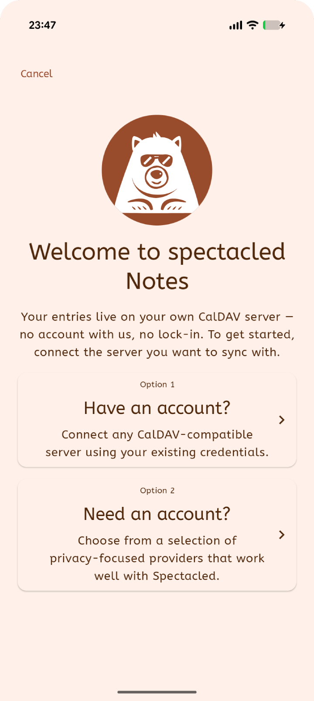
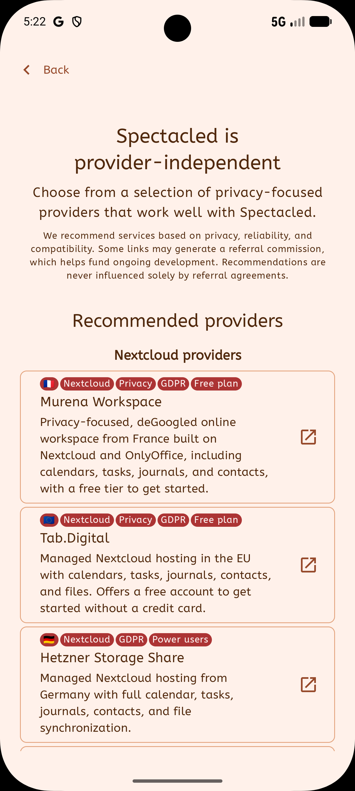
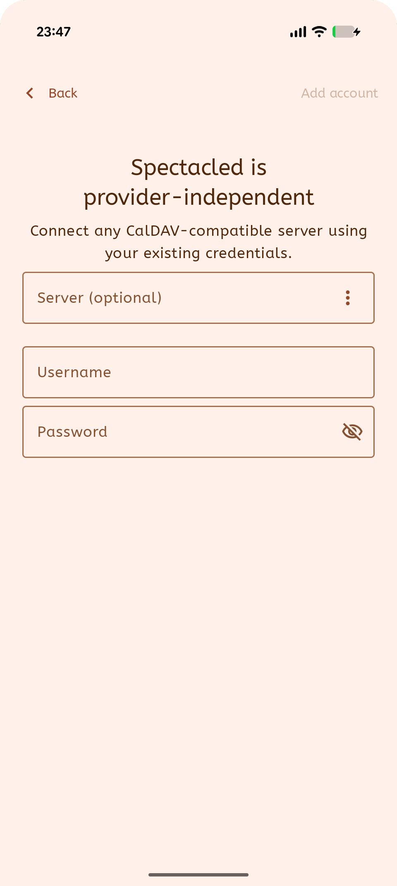
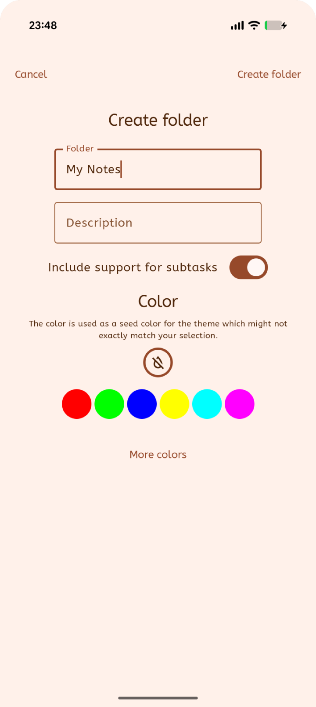
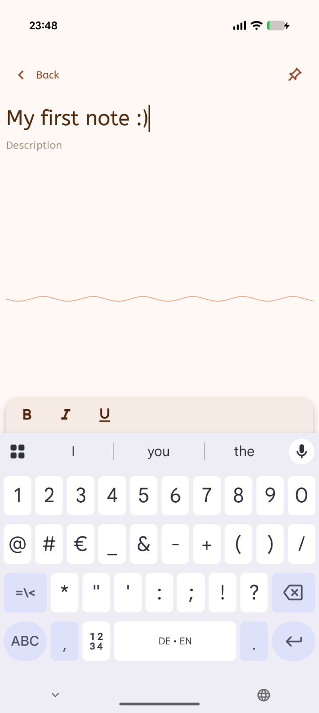

# Getting started with Spectacled

Spectacled stores your notes, journals, and tasks on a CalDAV server that you
choose. There's no Spectacled account, no proprietary backend, and nothing to
export if you ever decide to leave — your entries are plain iCalendar data,
sitting on your own server, readable by anything else that speaks the format.

This guide takes you from a freshly installed app to your first saved entry.
It takes about five minutes, most of which is creating an account with a
provider.

> **Prefer to watch?** The same walkthrough is available as a video:
> <https://youtu.be/lu-Grqnp4no>

---

## Install Spectacled

Spectacled runs on Android, iOS, the web, and desktop. Every available build is
listed on the download page:

### 📥 [spectacled.techbee.at/download](https://spectacled.techbee.at/download/)

All three apps are there - Journals, Notes, and Tasks. They install and connect
independently, so you can use one, two, or all three. This guide uses
**Spectacled Notes** for its examples; the steps are identical in the others.

---

## Before you start

You need an account on a CalDAV server. If you already have one - a Nextcloud
instance, a Baikal or Radicale server, or a hosting provider that offers CalDAV
- you can skip straight to [Connect your account](#3-connect-your-account).

If you don't, Spectacled will suggest a few providers, and this guide uses
[Murena Workspace](https://murena.com/workspace/partner/techbee/) as its
example: a privacy-focused, de-Googled workspace from France, built on
Nextcloud, with a free tier.

**One thing to check if you're bringing your own server.** Notes and journals
are stored as `VJOURNAL`, a part of the iCalendar standard that far fewer
servers implement than the calendar and task parts. Nextcloud-based servers
handle it; a number of CalDAV-capable mail providers do not, and can only be
used with Spectacled Tasks. If you're picking a host yourself, confirm
`VJOURNAL` support before you commit to it.

---

## 1. Open the app

On first launch, Spectacled asks for exactly one thing: where your data should
live. A welcome sheet appears over the app with two options.

- **Option 1 - "Have an account?"** connects an existing CalDAV account.
- **Option 2 - "Need an account?"** shows a short list of providers that work
  well with Spectacled.

Nothing is stored anywhere until you complete one of these, and neither option
creates an account with us - there isn't one to create.

---

## 2. Choose a provider

Tap **"Need an account?"**. Spectacled shows providers grouped into categories -
Nextcloud providers, self-hosted solutions, and, in Spectacled Tasks, email
providers with CalDAV support.

Each provider card carries badges summarising what matters at a glance: where
it's hosted, what it's built on, whether there's a free plan. These are
recommendations rather than requirements - Spectacled is provider-independent
and will talk to any compatible server.

The list is filtered to what the app you're using actually needs. In Spectacled
Notes and Journals you'll only see hosts that support journals, which is why the
email-provider category doesn't appear there at all.

> Some provider links earn the project a referral commission, which is stated
> on the screen itself and helps fund development. Recommendations are not
> determined by those agreements.

To follow this guide, tap **Murena Workspace**. Your browser opens Murena's
sign-up page. Create your account there, note the username and password you
chose, and return to Spectacled.

---

## 3. Connect your account

Back in the app, tap **Back**, then **"Have an account?"**.

There are three fields, and you often only need two of them:

| Field                 | What to enter                                                                                                                                                             |
|-----------------------|---------------------------------------------------------------------------------------------------------------------------------------------------------------------------|
| **Server (optional)** | Leave it empty. Spectacled derives the address from your username's domain - for `you@murena.io` it finds `https://murena.io` and locates the CalDAV endpoint from there. |
| **Username**          | Your full Murena address, e.g. `you@murena.io`.                                                                                                                           |
| **Password**          | See the note below if you use two-factor authentication.                                                                                                                  |

If automatic detection doesn't work for your provider, the **⋮** menu at the end
of the Server field has ready-made CalDAV addresses for the providers Spectacled
knows about. For Murena that's `https://murena.io/remote.php/dav`. You can also
type any address by hand.

> **Using two-factor authentication?** Your normal password will be rejected.
> Nextcloud-based servers - Murena included - need an *app password* instead:
> generate one under **Settings → Security → Devices & sessions**, then paste
> that into Spectacled. This is worth doing even without 2FA, since it lets you
> revoke this one device without changing your main password.

Tap **Add account**. Spectacled connects, asks the server what it supports, and
lists the folders it finds. Only folders that can actually hold your entries
appear - anything calendar-only or task-only is filtered out, which is expected
behavior rather than a failure.

If you typed an address beginning with `http://` rather than `https://`,
Spectacled warns you before continuing. Don't send your password over an
unencrypted connection unless you genuinely know why you're doing it.

---

## 4. Create a folder

A new account usually has nowhere to put notes yet. On the **Accounts** screen,
open the **⋮** menu on your account and choose **Create folder**.

- **Folder** - the name, and the only required field.
- **Description** - optional.
- **Include support for subtasks** - leave this on and the folder can hold tasks
  alongside your notes, so an entry can have checkable subtasks beneath it. (This
  switch appears only in Spectacled Notes and Journals, and only when creating a
  new folder.)
- **Colour** - follows the folder throughout the app, which is what keeps a long
  list scannable later.

Tap **Create folder**. The folder is created on the server, not just on this
device, so it will appear in every other Spectacled app and on any other client
you connect.

If the button reports insufficient access rights, your account can read that
part of the server but not create collections in it - check the account's
permissions with your provider.

---

## 5. Write your first entry

Tap the new folder to open it, then tap **Add note** (or **Add journal** /
**Add task**, depending on which app you're using).

Type a summary at the top and your text below it. To tag the entry, use the
label icon in the bottom bar to open the category selector.

**There is no save button, and that's deliberate.** Spectacled saves as you type,
and syncs that folder as soon as you leave the entry. It also syncs periodically
in the background - every 15 minutes on Android and desktop, whenever the tab
regains focus on the web, and whenever iOS grants the app background time.
Navigate back and your entry is already in the list.

Everything is also cached locally, so the app keeps working on a plane or a bad
connection and catches up when you're back online.

---

## Where your data actually lives

Worth understanding, because it's the point of the whole app:

- Your entries are `VJOURNAL` components (notes and journals) or `VTODO`
  components (tasks), defined by [RFC 5545](https://www.rfc-editor.org/rfc/rfc5545),
  the same standard behind the `.ics` files your calendar app exchanges.
- They are stored in collections on your CalDAV server. Spectacled calls these
  *folders*; your server may call them *calendars*.
- Spectacled keeps a local copy so it works offline, but the server holds the
  authoritative version.
- Nothing is sent to Techbee. There is no Spectacled server in the path at all.

This means other clients can read the same data - and if you stop using
Spectacled, your entries stay exactly where they already are.

---

## If something goes wrong

| What you see                                                   | What it usually means                                                                                                                                                      |
|----------------------------------------------------------------|----------------------------------------------------------------------------------------------------------------------------------------------------------------------------|
| **Not authorized**                                             | Wrong username or password - or two-factor authentication is enabled and you need an app password (see step 3).                                                            |
| **Not found**                                                  | The server address is wrong, or the account has no CalDAV endpoint at that address. Try the **⋮** menu's ready-made address for your provider.                             |
| **No compatible folders/calendars found**                      | The server has no collection that can store this app's entries. On a server without `VJOURNAL` support, Notes and Journals will find nothing even though Tasks might work. |
| **Request error**                                              | Check your server, username, and password.                                                                                                                                 |
| **Connection error / Connection timed out**                    | Network problem, or the server is unreachable.                                                                                                                             |
| **Insufficient access rights to create a new folder/calendar** | Your account can read but not create collections here.                                                                                                                     |
| **Warning: Insecure connection (HTTP)**                        | The address starts with `http://`. Use `https://` wherever your server supports it.                                                                                        |
| **Sync problem** on a folder card                              | Tap the folder's sync indicator for the specific error and technical detail.                                                                                               |
| **Read only** on a folder                                      | The server grants you read access only; entries there can't be edited.                                                                                                     |
| **Credentials not found**                                      | Remove the account and add it again.                                                                                                                                       |

To force a sync at any time, use the refresh icon in a list's top bar, or
**Refresh all** from the **⋮** menu on the account. **Reload folders** re-runs
discovery, which is what you want after creating a collection elsewhere.

---

## Journals, Notes, and Tasks

Spectacled ships as three separate apps that share one codebase and connect to
servers identically:

|                         | Stores     | Best for                                    |
|-------------------------|------------|---------------------------------------------|
| **Spectacled Journals** | `VJOURNAL` | Dated journal entries                       |
| **Spectacled Notes**    | `VJOURNAL` | Free-form notes                             |
| **Spectacled Tasks**    | `VTODO`    | To-dos with status, priority, and due dates |

The steps above are the same in all three. The only differences are the name of
the add button, and that the subtasks switch in step 4 doesn't appear in
Spectacled Tasks. Because Tasks only needs `VTODO`, it also works with a wider
range of servers - including several CalDAV-capable mail providers that can't
store notes or journals.

---

## Next steps

- Connect a second device, or the web app, and your folders appear there
  automatically - every build is on the
  [download page](https://spectacled.techbee.at/download/).
- Add more accounts - Spectacled handles several servers side by side.
- Found a bug, or a server that misbehaves?
  [Open an issue](https://github.com/TechbeeAT/spectacled/issues).
